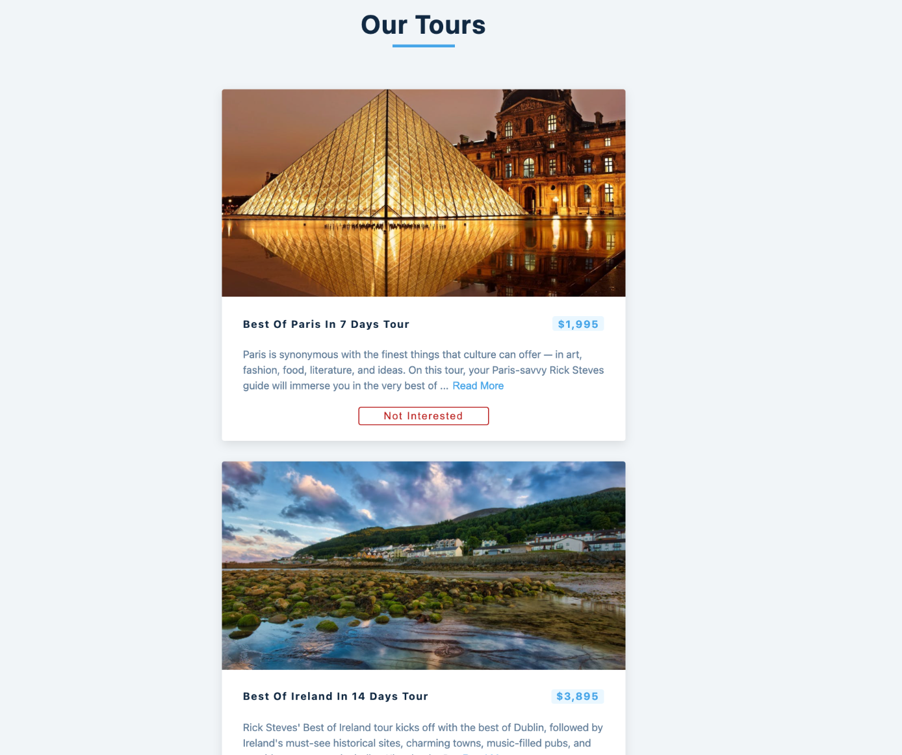

## React Tour Project

This project is based on useState and useEffect learning concept.

Learnings:
- Conditional Loading and error message display
- Fetch data using async and await and list the data
- delete data
- refresh data