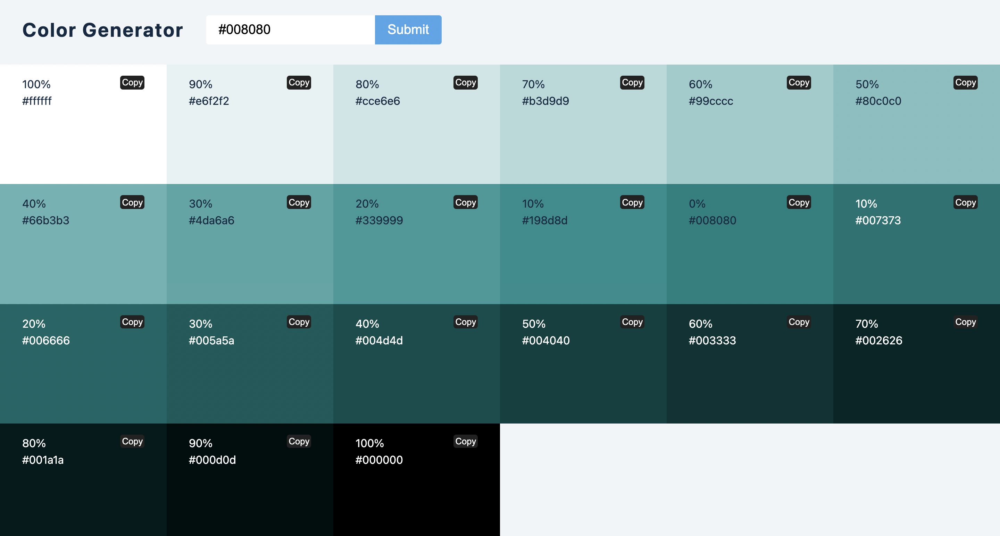

## Color Generator

- This project includes:
    - Validation on correct input (valid color value)
    - Display 20 shades of given color
    - Set background of each color
    - change color text value based on shades.(darker shades have light color text)
    - Copy button added to copy color hex value
    - After clicking on copy button change text to copy to clipborad
    - Save color in clipboard
    - Make copy event cleared after 3 seconds. 
    
- Library to get all shades of color: [values.js](https://github.com/noeldelgado/values.js)

